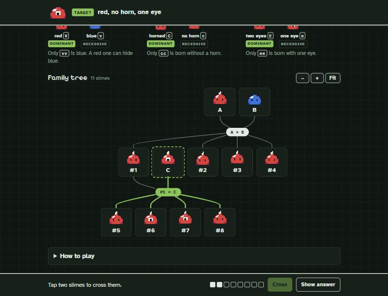

# Slime Cross

A daily puzzle about genetics. You get three slimes with hidden genes and a target slime, and you have to breed the target. Everyone gets the same puzzle each day.

Play at [slimecross.com](https://slimecross.com). It's in English, Portuguese and Japanese.

## Rules

Each slime has two copies of each gene (color, horn and eyes), one from each parent. If a slime has a dominant copy, that's the trait you see. The recessive trait only shows when both copies are recessive, so a slime can carry a trait without showing it and pass it on to its offspring.

A cross always gives 4 offspring, in the exact proportions Mendel found. Crossing the same pair again gives the same litter, so you solve the puzzle by figuring out what each slime is hiding.

The daily puzzle needs at least 3 crosses, and you have 8. There's a short tutorial, an easy mode that shows the gene letters, and a practice mode with harder variants.

## Code

Everything is in `index.html`, with no build step. It uses [dagre](https://github.com/dagrejs/dagre) to draw the family tree, plus fonts from Google Fonts. Your progress is saved only in your browser. The site counts visits with Cloudflare's analytics, which doesn't use cookies.

To run it locally, open `index.html`. Pushing to `main` publishes the site on Cloudflare Pages.

There's also a Python simulation in `ferramentas/` that I used to set the difficulty of the daily puzzles.
